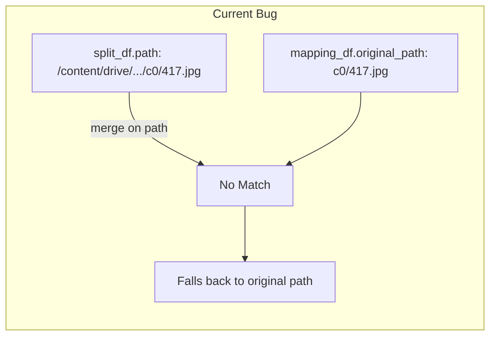

# Fix Hybrid CSV Generation for Split Files

## Problem Summary

The split CSVs (`train_*.csv`, `val_*.csv`, `test_*.csv`) are generated incorrectly because:

1. Original split CSVs contain **absolute paths** like `/content/drive/.../c0/417.jpg`
2. The extraction code stores **relative** `original_path` like `c0/1.jpg` in `out_records`
3. The merge in `hybrid_extract.py` (lines 572-590) fails to match these, so paths fall back to originals



## Changes Required

### 1. Fix [`src/ddriver/data/hybrid_extract.py`](src/ddriver/data/hybrid_extract.py)

Modify the split CSV generation logic (around line 572) to:

- Extract just the filename from both the split CSV paths and the mapping `original_path`
- Match on **filename + class_id** to avoid collisions (different classes have same filenames like `1.jpg`)

Key change to the merge logic:

```python
# Before merge, extract filename for matching
split_df["_filename"] = split_df["path"].apply(lambda p: Path(p).name)
split_df["_class"] = split_df["path"].apply(lambda p: ...)  # extract c0-c9
mapping_df["_filename"] = mapping_df["original_path"].apply(lambda p: Path(p).name)
mapping_df["_class"] = ...  # extract from path
# Merge on filename + class instead of full path
```


### 2. Add CSV Regeneration Cell to [`notebooks/colab_setup.ipynb`](notebooks/colab_setup.ipynb)

Add a new utility cell after the Hybrid extraction cell that:

- Scans existing crops using `rglob("*.jpg")` to handle both flat and nested structures
- Matches to original manifest by filename + class_id
- Generates correct `manifest_*.csv` and split CSVs

This cell will work for both:

- **face_hands** (flat structure: `hybrid/face_hands/c0/`)
- **face** (nested structure: `hybrid/face/auc.distracted.../Camera_/c_/`)